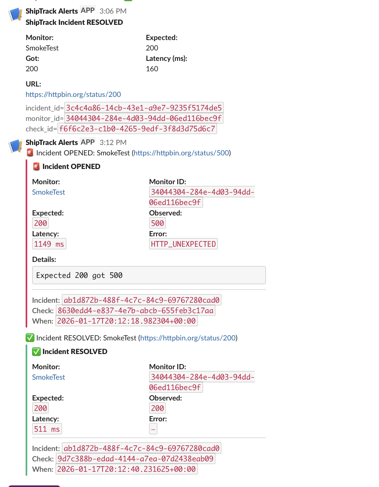
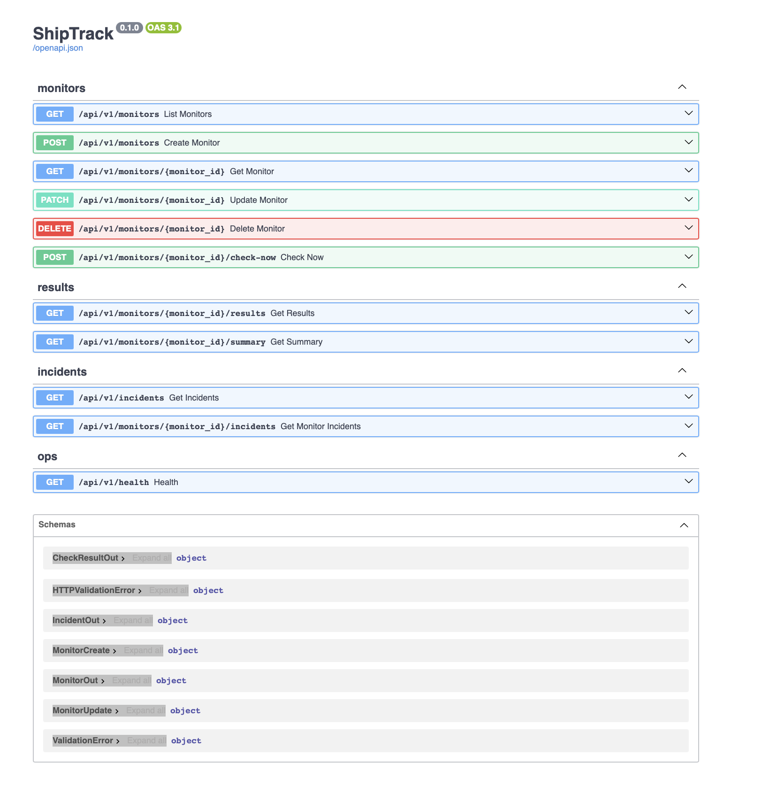

# ShipTrack — Uptime Monitoring + Incident Alerts (FastAPI + Postgres + Slack)

ShipTrack is a lightweight uptime monitoring service that runs HTTP checks against monitored endpoints, records latency + results, and creates **stateful incidents** with **Slack alerts** on OPEN and RESOLVED transitions (no alert spam).

## What it does
- Create & manage monitors (URL, method, expected status, interval, timeout, headers)
- Run on-demand checks (`/check-now`) with retry + backoff for network/timeouts
- Store check results (status, latency, error type/message)
- **Incident engine**: opens after consecutive failures, resolves after consecutive successes
- Slack notifications for incident **OPENED** and **RESOLVED**
- 24h summary stats (uptime %, avg/median latency)

## Tech Stack
- FastAPI (REST API)
- SQLAlchemy + Postgres
- httpx (HTTP client)
- Docker Compose
- Slack Incoming Webhooks

## Quickstart (Docker)
```bash
docker compose up -d --build

## Screenshots

### Slack Incident Alerts (OPEN → RESOLVED)
Real-time Slack alerts are sent **only on incident state transitions** to avoid alert spam.



---

### API Surface (Swagger / OpenAPI)
Interactive REST API for monitors, checks, incidents, and summaries.


